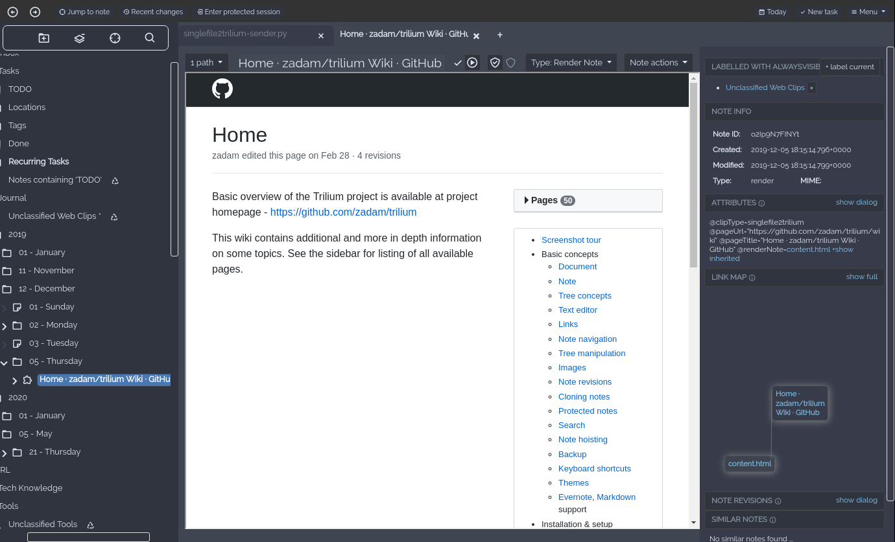

# [singlefile2trilium](singlefile2trilium/README.md)
Save faithful copy of a web page as a [Trilium](https://github.com/zadam/trilium) note with [SingleFile](https://github.com/gildas-lormeau/SingleFile) web extension.
> 
