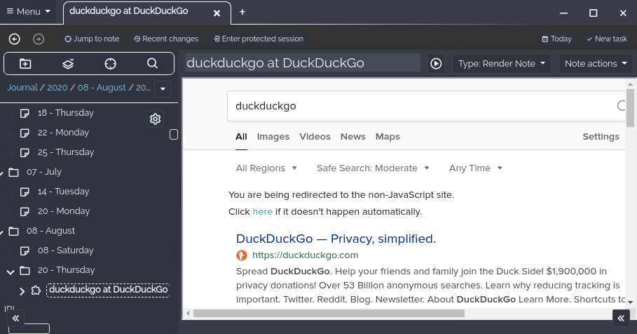
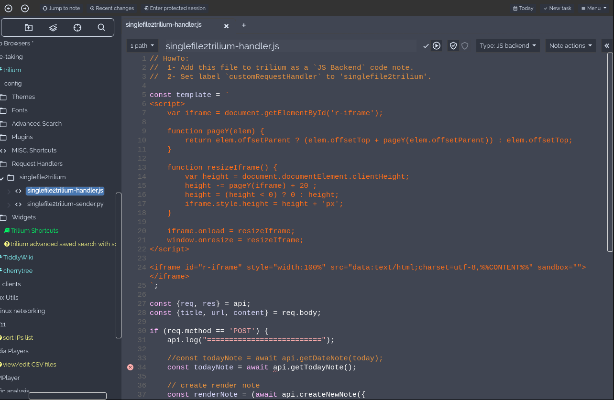
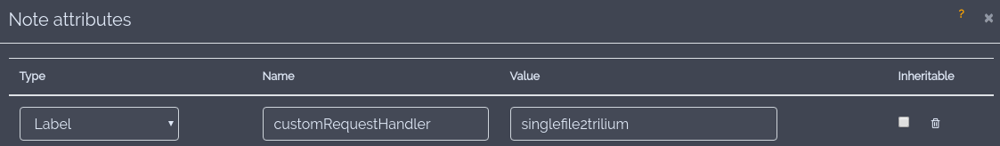

# [singlefile2trilium]
Save faithful copy of a web page as a [Trilium] note with [SingleFile] web extension.
   

## How it Works
[SingleFile] web extension saves a faithful copy of the web page being rendered by your browser as a single HTML file.
It's default location is `~/Downloads`.

#### singlefile2trilium is composed of two scripts:
1. **[singlefile2trilium-sender.py]** script continuously watches `~/Downloads` directory for new html pages saved by `SingleFile` and sends them to trilium.
2. **[singlefile2trilium-handler.js]** is a trilium [custom request handler]. It handles and converts data sent by `singlefile2trilium-sender.py`.

The handler wraps the html content into an html iframe, which is itself rendered by a render note.


## Installation

**singlefile2trilium** has the following dependencies:
* Python 3.x
* [Trilium] >= v0.38
* [SingleFile]

#### A) Configure [singlefile2trilium-handler.js]
1. add the file to trilium as a `JS Backend` code note:
   
2. set `customRequestHandler` label to `singlefile2trilium`:
   


#### B) Configure [singlefile2trilium-sender.py]
1. copy the script somewhere on your computer.
2. change `BASEDIR` & `TRILIUM_URL` vars in script according to your needs.
3. configure your system to [run the script at startup](https://specifications.freedesktop.org/autostart-spec/autostart-spec-latest.html) (as a daemon):
   ```bash
   user@desktop $ ./singlefile2trilium-sender.py
   ```


## Usage
1. Use **SingleFile** add-on in your browser to save a web page
   
2. You have now a new **Trilium** note rendering faithfully the web page in your [day note](https://github.com/zadam/trilium/wiki/Day-notes)
   


## Throubleshotting
* Ensure trilium installed version is > 0.38
* Here is a screenshot of my own singlefile config, may help if default options don't work:
  


[singlefile2trilium]: .
[singlefile2trilium-sender.py]: singlefile2trilium-sender.py
[singlefile2trilium-handler.js]: singlefile2trilium-handler.js

[Trilium]: https://github.com/zadam/trilium
[custom request handler]: https://github.com/zadam/trilium/wiki/Custom-request-handler

[SingleFile]: https://github.com/gildas-lormeau/SingleFile

